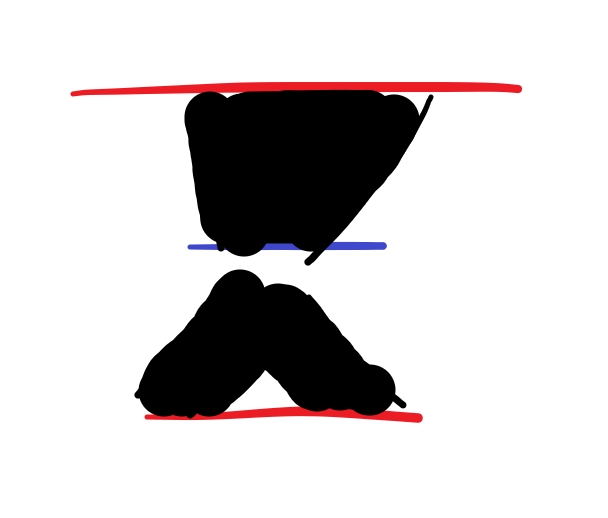

# tools for JCVI 

This repo is used to tentatively deposit some scripts I used in my synteny analysis using JCVI

> why "tentatively"? 
>
> Because I might continue adding new scripts or revising the old scripts.


### (1) within- or between species synteny analysis 

1. we need to create a configure file.

```shell
vim jcvi.config
# species1 species1
# species1 species2
```

As shown above and in this repo, the configure file contains the species you want to explore the synteny relationship.

Each line represents a analysis that conduct within species or between two species, 

e.g. 

- `species1 species1` means run JCVI on its own genome.
- `species1 species2`means run JCVI between species1 and species2.

2. After specified the configure file, now it's time to run the JCVI automatically, not manually.

```shell
sh run_jcvi.sh
```

Finally, there are some matters needing attention: The config file you specified in the `run_jciv.sh`, it should name after the config you created.


### (2) JCVI painting

`v2.jcvi_painting.py` is used to paint the synteny relationships without manually changing the `.simple` file which is created by the JCVI.

1. color config file

for example, there are 12 chromosomes/blocks in the genome you studied and you want to set 12 different colors for the each chromosomes/blocks, you should create a `color config` (this file is tab-delimited) like below:

```shell
1	#fa8072
2	#003153
3	#ffff4d
4	#800080
5	#6495ED
6	#00FFFF
7	#98FB98
8	#7FFF00
9	#808000
10	#FFFACD
11	#FFA500
12	#CD5C5C
```

Then, run the python scripts above,

```shell
python3 v2.jcvi_painting.py --bed species1.bed --config color.config --simple species1.species2.anchors.simple --output new.species1_species2.simple

# save the origin .simple file
mv species1.species2.anchors.simple species1.species2.anchors.simple.back
mv new.species1_species2.simple species1.species2.anchors.simple
# run JCVI macro visualization
python -m jcvi.graphics.karyotype seqids layout
```


### (3) grep gene from two synteny blocks 

There is a graph:

The upper red line represents the chromosome 1 from speciesA, the one below is chromosome 2 from speciesA. 

The blue one in the middle represents the chromosome X from speciesB.

And the black shows the synteny relationships between the chromosomes.

> X is not relevant to the sex chromosome, just a symbol.




`extractblocks.py` is used to extract the gene ID of chromosome1, chromosome2 and chromosomeX which demonstrated the interrelationships between two species.

The usage, 

```shell
python v2.extractblocks.py --help
usage: extractblocks.py [-h] -b1 BED -b2 BED -a  -c1  -c2  -c3  -o1  -o2  -o3

optional arguments:
  -h, --help            show this help message and exit
  -b1 BED, --species1 BED
                        Unique BED file of speciesA generated by JCVI
  -b2 BED, --species2 BED
                        Unique BED file of speciesB generated by JCVI
  -a , --anchors        .anchors file generated by JCVI
  -c1 , --chromosome1   Set the one chromosome of speciesA
  -c2 , --chromosome2   Set the another one chromosome of speciesA
  -c3 , --chromosome3   Set the one chromosome of speciesB
  -o1 , --output1       Set the output name of gene ID list of speciesA chromosome1
  -o2 , --output2       Set the output name of gene ID list of speciesA chromosome2
  -o3 , --output3       Set the output name of gene ID list of speciesB chromosome3
```


# Pholygenomics based on JCVI and OrthoFinder2

Using the JCVI, we know which blocks (chromosomes) have the synteny relationships, and then know which genes are within those corresponding blocks.

Then Using the OrthoFinder2, to find the single-copy orthologues gene group in these datasets.

> Note: there are difference between synteny relationships and orthologous relationships

Now we have single-copy orthologues gene, but we want to dig in deeper —— What should we do?

The answer is that we divide the single-copy orthologues gene dataset into exon datasets and intro datasets, and we use them to reconstruct the phylogenetic tree.

> Note: Why seperate the dataset into exon and intro?
>
> exon is the conservative sequence, which might maintain the ancestral information, thus helping us reconstruct the evolution relationships, but there might be a clade of species which came into being in a short time and the exon sequence had not ready yet to conserve the evolution and speciation information. So we need to use the intro sequence which is not conservative, and it might posses a lot of evolution informaion which we could apply info our study.

### (1) extract the exon ID from OrthoFinder2 resutls

Based on the results OrthoFinder2, We can get a group of single-orthologue gene (`Single_Copy_Orthologue_Sequences`).

According to the background info above, I think you're very clear about the analysis we are going to conduct below.

**First**, we parse the gff information using `gffutils`.

`gffdb.py`, this module contains the functions to build and load the local gff database.

There are a few caveats: 

- put all the gff you need to parse in the dir `gffpath`
- make a new dir called `gffdatabase`

Then you could parse the info in gff in a multiprocessing mode.


**Second**, after building the database, we can extract the exon information which is provided by the single-copy orthologues using the module `singlecopyFinder.py`.

You should move or copy the `Single_Copy_Orthologue_Sequences` to your working dir and then run the function `Exonbed` and write the bed file using `Writebed`.

All the output files will be written into the `BED_of_Exon_of_SingleCopygene`.


# To be continued

